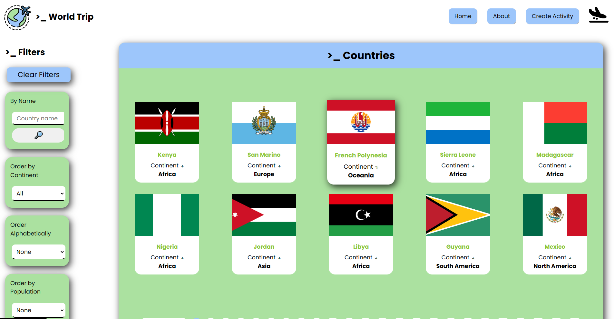
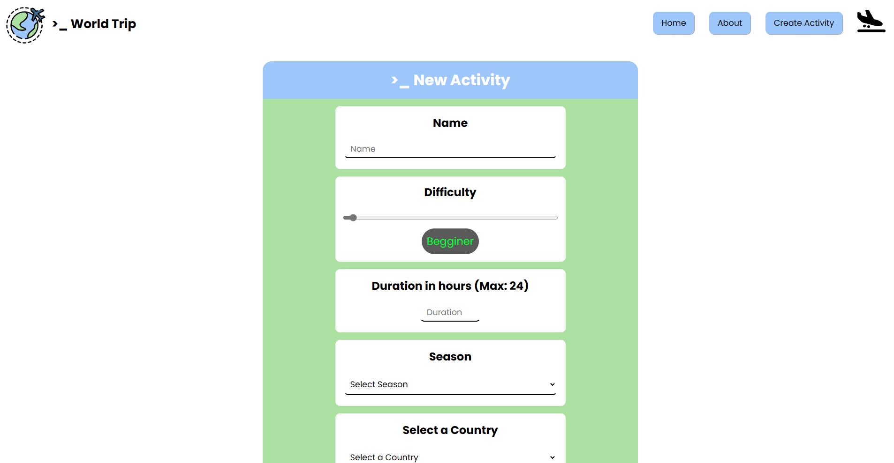

<!-- PROJECT SHIELDS -->
<!--
I'm using markdown "reference style" links for readability.
 https://www.markdownguide.org/basic-syntax/#reference-style-links
-->

[![LinkedIn][linkedin-shield]][linkedin-url]
[![Contributors][contributors-shield]][contributors-url]
[![Forks][forks-shield]][forks-url]
[![Stargazers][stars-shield]][stars-url]
[![Issues][issues-shield]][issues-url]
[![MIT License][license-shield]][license-url]

<!-- PROJECT LOGO -->
 

  

<h2 align="center">>_ World Trip</h2>

  

    Welcome to <strong>World Trip</strong> - a dynamic web application crafted using the [countries] API. Dive deep into a rich tapestry of information, activities, and insights about nations across the globe!
 
<a href="https://github.com/hebelia/Countries-App"><strong>:open_file_folder: Explore the documents »</strong></a>
 
 
<a href="https://github.com/hebelia/Countries-App">Initial release</a>
·
<a href="https://github.com/hebelia/Countries-App/issues">Report bug</a>
·
<a href="https://github.com/hebelia/Countries-App/issues">Request feature</a>

<!-- TABLE OF CONTENTS -->

  
 Contents ↴

  <ul>
    <li><a href="#built-with">Built with</a></li>
    <li><a href="#features">Features</a></li>
    <li><a href="#roadmap">Roadmap</a></li>
    <li><a href="#contributions">Contributions</a></li>
    <!-- <li><a href="#Acknowledgments">Acknowledgments</a></li> -->
    <li><a href="#License">License</a></li>
    <li><a href="#Contant">Contact</a></li>
  </ul>

<!-- ABOUT THE PROJECT -->
 

<!-- gif del proyecto -->

<!-- [![Product Name Screen Shot][product-screenshot]](https://example.com) -->

(<a href="#readme-top"> △ </a>)

## >\_ &nbsp; Built with 📌

 

[![React][React-badge]][react-url] [![Redux][Redux-badge]][redux-url] [![Node][Node-badge]][Node.js-url] [![Nodemon][Nodemon-badge]][Nodemon-url] [![Express][Express-badge]][express-url] [![Sequelize][Sequelize-badge]][sequelize-url] [![Vite Badge][Vite-badge]][vite-url] [![CSS][CSS]][css-url] [![GitHub][github.com]][github-url]

   
   

<!-- - [![Firebase][firebase.com]][firebase-url]

  - for the **deployment** -->

(<a href="#readme-top"> △ </a>)

<!-- DESCRIPTION -->
<h1 id="features">>_ Features 🚀 </h1>
 
<!-- <h3>This project is a SPA (Single Page Application) that consumes an API to display all the countries</h3> -->
<ul>
  <li><strong>Search Nations:</strong> Enter the name of any country and find it from our comprehensive list.</li> 

  <li><strong>Country Profiles:</strong> Get detailed information about each nation, including its capital, flag, currency, and much more.</li> 
  <li><strong>Filtering:</strong> Filter out countries based on specific criteria without relying on external API endpoints.</li> 
  <li><strong>Ordering:</strong> Prioritize your search results based on your needs. Whether it's by population size, GDP, or alphabetical order.</li> 
  <li><strong>Touristic Activities:</strong> Planning a trip? Discover and create unique touristic activities for each country!</li> 

</ul>

⚠️ <strong></strong>Note: Filtering and ordering functionalities have been implemented natively. I did not utilize external API endpoints that return pre-filtered or pre-ordered results.

▷ Client link: [⋄ click here ⋄](https://github.com/hebelia/Countries-App/tree/main/client)

▷ Server link: [⋄ click here ⋄](https://github.com/hebelia/Countries-App/tree/main/server)

<!-- 

<i> ∆ note: </i>

  
 <a>Object Relational Mapping (ORM) :mag_right: </a>

<i> ∆ note:</i>

 -->

## >\_&nbsp; Project visualization :

<!-- cambiar links a links de imagenes dentro del repositorio y agregar mas -->
 

  
 <a> Landing </a>

  
 <a> Landing mobile  </a>

  
 <a> Home </a>

  
 <a> Country details  </a>

  
 <a> Create activity form </a>

<!-- 

  
 <a> About </a>

 -->

    

 

(<a href="#readme-top"> △ </a>)

<!-- ROADMAP -->
<h2 id="roadmap">>_ Extra features :bookmark:</h2>

 :heavy_check_mark: Best Practices 🌟
  Including:

<ul>
<li><strong>Modularity:</strong> Code is structured modularly to enhance clarity and maintainability.</li>
<li><strong>Reusability:</strong> Frontend components are reused where applicable, and backend helpers are employed to streamline operations.</li>
</ul>

 :heavy_check_mark: Responsive design

 
 

<!-- CONTRIBUTING -->
<h2 id="contributions">>_&nbsp;  Contributions :bulb:</h2>

Contributions and suggestions are what make the open source community such an amazing place to learn, inspire, and create. Any contribution you make is **greatly appreciated**
 
:pushpin: Pushpins to the repository can be done by forking and doing a pull request or by simply opening an "issue" with the tag "improvement".

Suggestions: [⋄ click here ⋄](https://github.com/hebelia/Countries-App/issues) see the full list of proposed features (and known issues).

(<a href="#readme-top"> △ </a>)

<!-- ACKNOWLEDGMENTS -->
<!-- <h2 id="Acknowledgments">:small_blue_diamond: Agradecimientos :small_blue_diamond:</h2>

- Special thanks to all my fellow classmates who have helped me along the lerning journey

(<a href="#readme-top"> △ </a>)
 -->

<!-- LICENSE -->
<h2 id="License">>_  &nbsp; License :copyright:</h2>

 
< Done with passion © 2023 Hebe Lia Romeu >
 
 

 
<!-- CONTACT -->

## >\_ &nbsp; Connect with me &nbsp; 📬

 

[][linkedin-url]
[][instagram-url]
[][email-url]
[][codepen-url]

[linkedin-url]: https://linkedin.com/in/hebeliaromeu
[instagram-url]: https://instagram.com/hebe.lia
[email-url]: mailto:hebeliaromeu@gmail.com
[codepen-url]: https://codepen.io/hebelia

(<a href="#readme-top"> △ </a>)

<!-- MARKDOWN LINKS & IMAGES -->

[contributors-shield]: https://img.shields.io/github/contributors/hebelia/Countries-App.svg?style=for-the-badge&color=abe1a0
[contributors-url]: https://github.com/hebelia/Countries-App/graphs/contributors
[forks-shield]: https://img.shields.io/github/forks/hebelia/Countries-App.svg?style=for-the-badge&color=abe1a0
[forks-url]: https://github.com/hebelia/Countries-App/network/members
[stars-shield]: https://img.shields.io/github/stars/hebelia/Countries-App.svg?style=for-the-badge&color=abe1a0
[stars-url]: https://github.com/hebelia/Countries-App/stargazers
[issues-shield]: https://img.shields.io/github/issues/hebelia/Countries-App.svg?style=for-the-badge&color=abe1a0
[issues-url]: https://github.com/hebelia/Countries-App/issues
[license-shield]: https://img.shields.io/badge/license-abe1a0?style=for-the-badge&logo=C&logoColor=3e6d8f
[license-url]: https://github.com/hebelia/Countries-App/blob/master/LICENSE.txt
[linkedin-shield]: https://img.shields.io/badge/-LinkedIn-abe1a0.svg?style=for-the-badge&logo=linkedin&logoColor=3e6d8f
[linkedin-url]: https://www.linkedin.com/in/hebeliaromeu/
[github-url]: https://github.com
[github.com]: https://img.shields.io/badge/GitHub-abe1a0?style=for-the-badge&logo=github&logoColor=3e6d8f
[React-badge]: https://img.shields.io/badge/React-abe1a0?style=for-the-badge&logo=react&logoColor=3e6d8f
[react-url]: https://react.dev
[Redux-badge]: https://img.shields.io/badge/Redux-abe1a0?style=for-the-badge&logo=redux&logoColor=3e6d8f
[redux-url]: https://redux.js.org/
[Node-badge]: https://img.shields.io/badge/Node.js-abe1a0?style=for-the-badge&logo=nodedotjs&logoColor=3e6d8f
[Node.js-url]: https://nodejs.org/en
[CSS]: https://img.shields.io/badge/SCSS-abe1a0?style=for-the-badge&logo=sass&logoColor=3e6d8f
[css-url]: https://developer.mozilla.org/en-US/docs/Web/CSS
[Nodemon-badge]: https://img.shields.io/badge/Nodemon-abe1a0?style=for-the-badge&logo=nodemon&logoColor=3e6d8f
[Nodemon-url]: https://nodemon.io/
[Express-badge]: https://img.shields.io/badge/Express.js-abe1a0?style=for-the-badge&logo=express&logoColor=3e6d8f
[express-url]: https://expressjs.com/
[Sequelize-badge]: https://img.shields.io/badge/Sequelize-abe1a0?style=for-the-badge&logo=sequelize&logoColor=3e6d8f
[sequelize-url]: https://sequelize.org/
[firebase.com]: https://img.shields.io/badge/Firebase-abe1a0?style=for-the-badge&logo=firebase&logoColor=3e6d8f
[firebase-url]: https://firebase.google.com
[Vite-badge]: https://img.shields.io/badge/Vite-abe1a0?style=for-the-badge&logo=vite&logoColor=3e6d8f
[vite-url]: https://vitejs.dev/

<!--  -->

<!-- IMAGES & MEDIA -->

<!-- [product-screenshot]:./front/public/media/preview-1.png.png

[portfolio-pc]:
[portfolio-mobile]:
[prtfolio-pc-admin]:
[portfolio-mobile-admin]: -->

<!-- -------- -->
